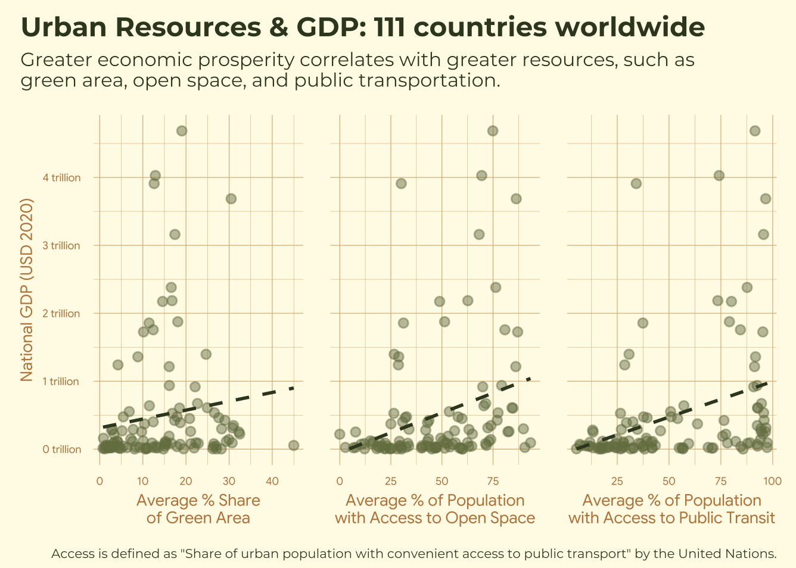

# Public Space in Major Cities: A Database

Building a database that organizes and houses UN-Habitat's Global Urban
Indicator data and links it to country-level GDP data. The culmination
of this project is the following visualization:



## Repository Structure and Description

```         
├── database.sql
├── query.sql
├── README.md
├── requirements.txt
├── viz.qmd
└── wrangling.qmd
```

To recreate this analysis: 

1. Download data from its sources
2. Ensure your R session fits the specifications in `requirements.txt`
3. Wrangle data using `wrangling.qmd`
4. Create database using SQL code in `database.sql`
5. Query database from `query.sql`, or run the `viz.qmd` script to both query (directly from R) and visualize the data

## Data Sources

**Urban Indicators Database**

The Data and Analytics Section is the specialized statistics unit within
UN-Habitat. They mainly work to promote consistent urban data production
and reporting, improve access to relevant, advance the translation of
data into policy, and guide the methodological development of the urban
related indicators. Their work helps monitor global progress towards the
[New Urban Agenda](https://data.unhabitat.org/pages/new-urban-agenda)
and achievement of the urban-related [Sustainable Development
Goals](https://data.unhabitat.org/pages/6486befd9595404887488626dce2dbed).

The following datasets were used in this project, sourced from the links
below: 
-  [Open spaces and green areas](https://data.unhabitat.org/pages/open-spaces-and-green-areas)
-  [Urban transport](https://data.unhabitat.org/pages/urban-transport)

**World Bank Open Data**

The World Bank Group provides global development data with the goal of
supporting evidence-based decision-making to advance development, and to
help ensure that a wealth of high quality, useful data is easy to access
and use for analysis, strategic planning, and policy action.

The following datatset was used in this project, sourced from the link
below:
-   [GDP (current USD)](https://data.worldbank.org/indicator/NY.GDP.MKTP.CD)

## References and Acknowledgements

This repository was created as part of the final project for the course
[EDS 213: Databases and Data
Management](https://ucsb-library-research-data-services.github.io/bren-eds213/).
Thank you to the instructors

-   [Julien Brun](https://bren.ucsb.edu/people/julien-brun)
-   [Greg Janée](https://bren.ucsb.edu/people/greg-janee)
-   [Annie Adams](https://bren.ucsb.edu/people/annaliese-annie-adams)
-   [Renata Curty](https://www.library.ucsb.edu/staff/renata-curty)

for providing me with the skills necessary to build this database!

Additionally, this project was inspired by the book Happy City by
Charles Montgomery, which has taught me the important of green spaces,
accessibility, and community for human joy in urban spaces.
